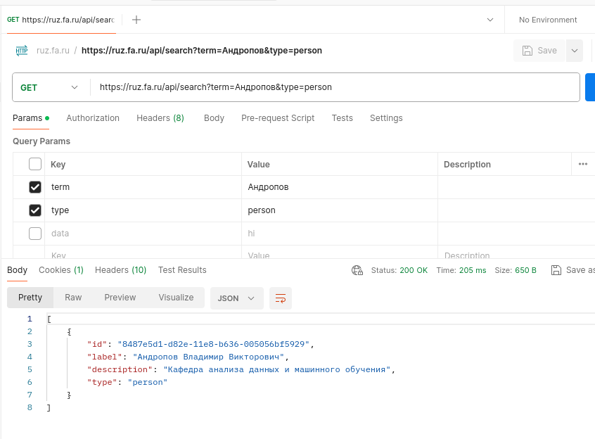
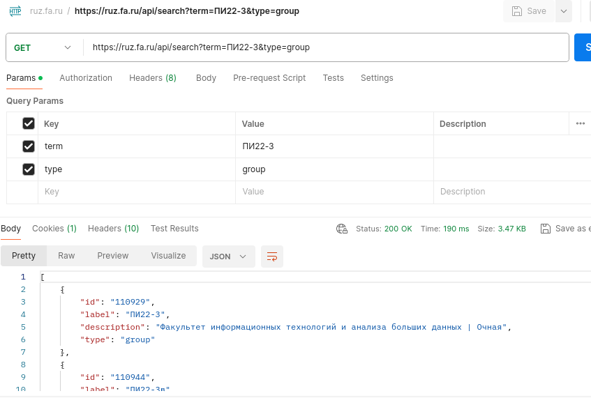
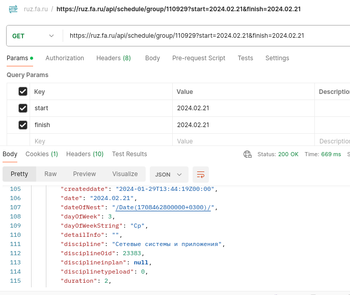
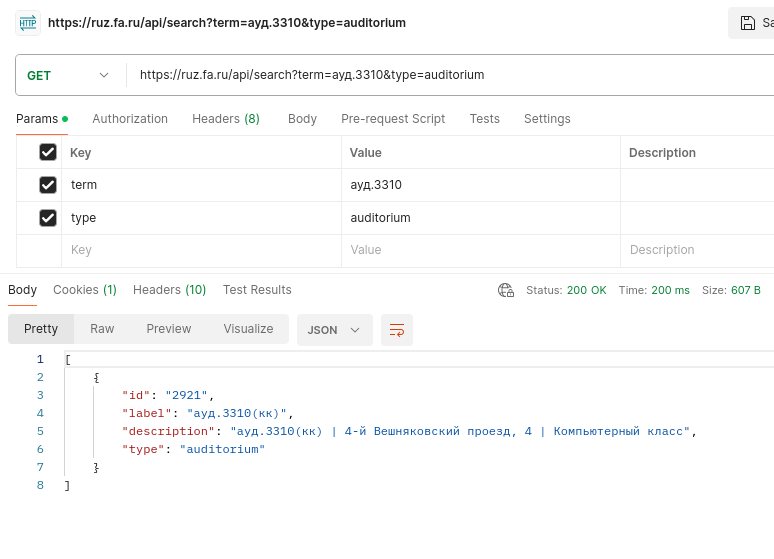
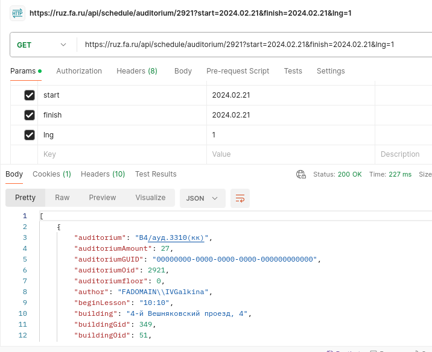
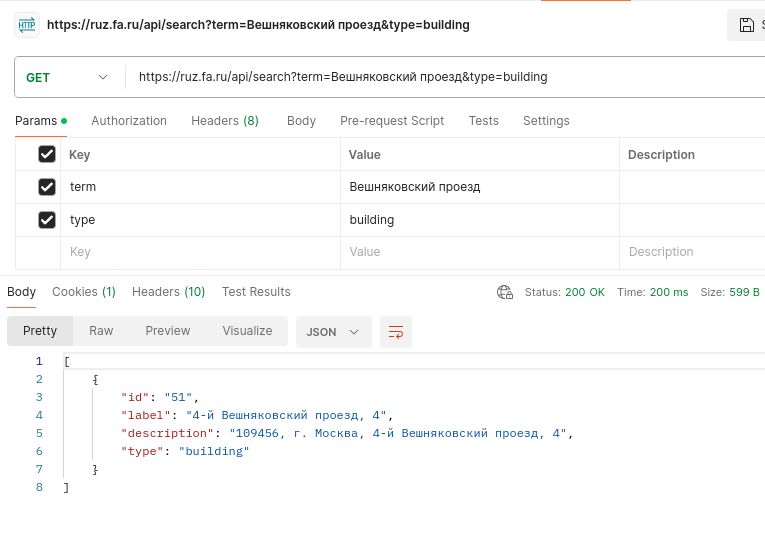
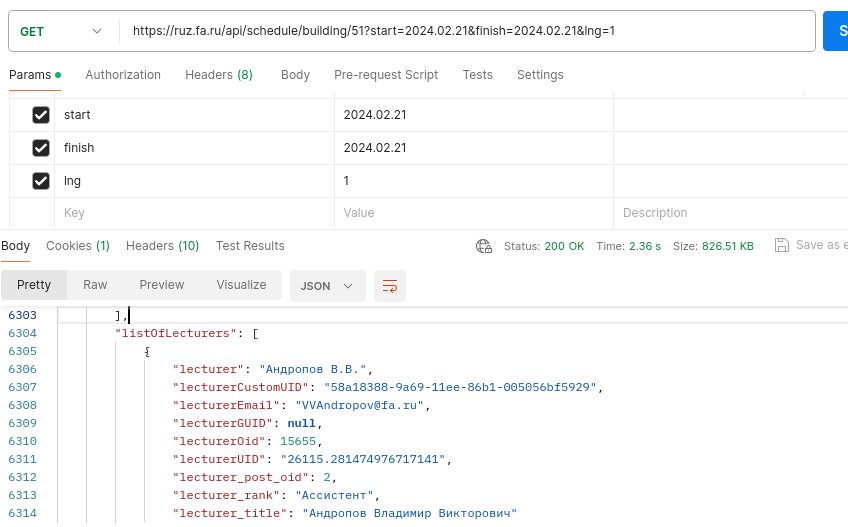

# Postman & библиотека requests

Цель: написать клиента к ruz.fa.ru

Ход работы:
1) скачать \установить \запустить Postman
2) импортировать \ открыть в Postman файл 4_requests/ruz.fa.ru.postman_collection.json 
3) выполнить Get-запросы
4) найти вкладку code в Postman \ сгенерировать Python код c request
______

# Get-запросы

## Запрос id преподавателя

https://ruz.fa.ru/api/search?term=Андропов&type=person

_____
## Запрос id группы

https://ruz.fa.ru/api/search?term=ПИ22-3&type=group

______
## Запрос предметов по id группы

https://ruz.fa.ru/api/schedule/group/110929?start=2024.02.21&finish=2024.02.21

__________
## Запрос id аудитории

https://ruz.fa.ru/api/search?term=ауд.3310&type=auditorium

________

https://ruz.fa.ru/api/schedule/auditorium/2921?start=2024.02.21&finish=2024.02.21&lng=1

________
## Запрос id здания по адресу

https://ruz.fa.ru/api/search?term=Вешняковский проезд&type=building

_________
https://ruz.fa.ru/api/schedule/building/51?start=2024.02.21&finish=2024.02.21&lng=1

